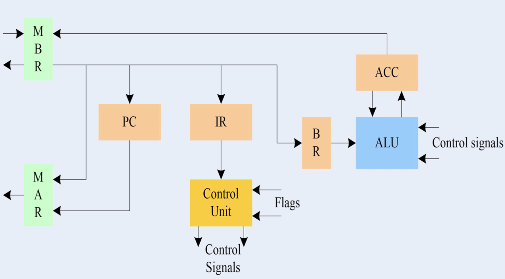
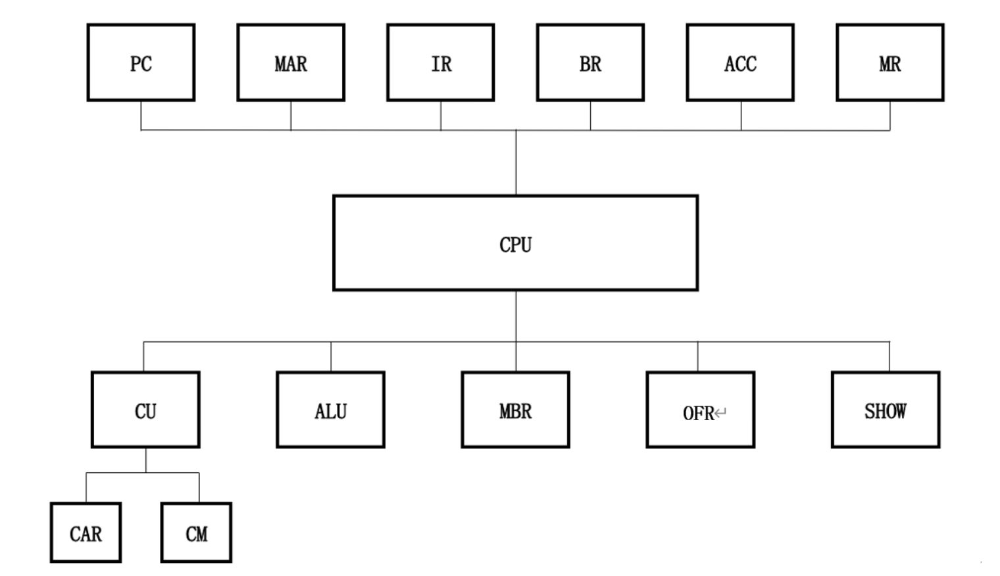
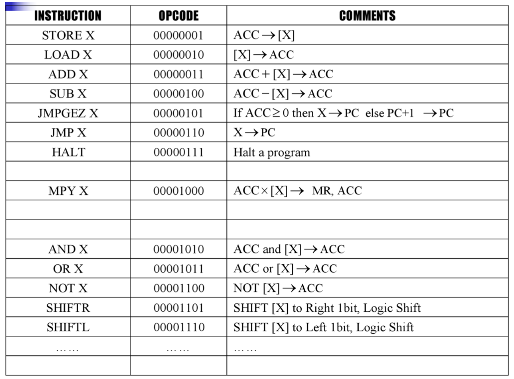
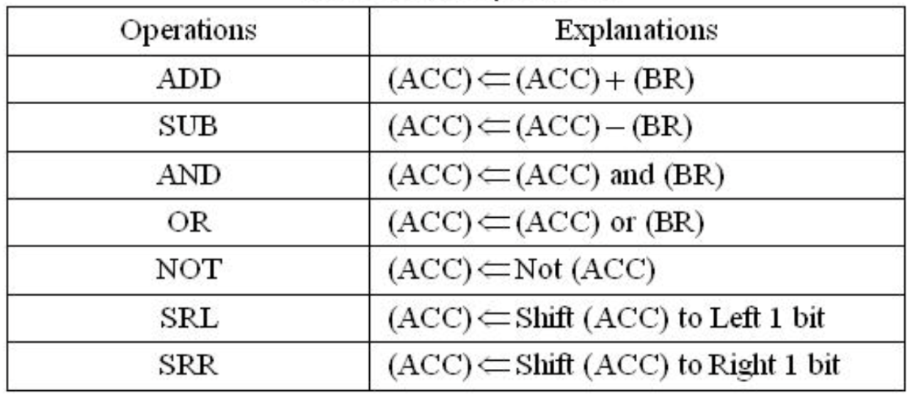
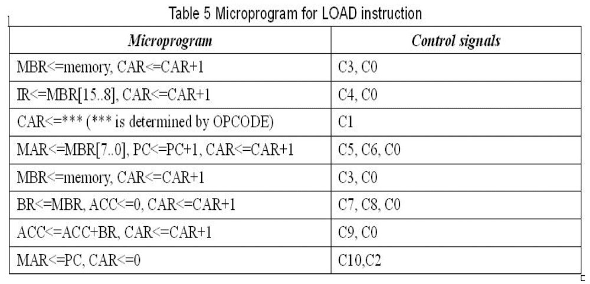
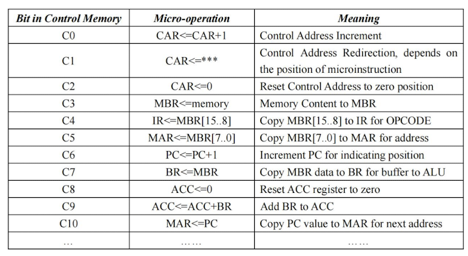

# CPU_System_Design_SEU_23Spring

## Project Overview
This project implements a simple CPU design with a basic instruction set that can execute simple programs. The CPU controller uses microprogramming to manage the fetch, decode, execute, and write-back stages of instruction processing.

## Features
- **Basic Functional Modules**: Supports key stages such as instruction fetch, decode, data fetch, data processing, and write-back.
- **Key Registers**: Includes Memory Address Register (MAR), Memory Buffer Register (MBR), Program Counter (PC), Instruction Register (IR), Buffer Register (BR), and Accumulator (ACC) for storing and manipulating data.

- **Instruction Set**: Implements a 16-bit instruction word with an 8-bit opcode and 8-bit address field, supporting operations like load, store, add, and subtract.

- **Arithmetic Logic Unit (ALU)**: Responsible for executing arithmetic and logic operations within the CPU.

- **Microprogrammed Control Unit**: The control unit, with its Control Memory (CM), generates control signals to direct CPU operations.

*micro_programs*

*control_signals*

## Project Structure
- **Top-Level Module**: Connects all modules into the CPU system.
- **Register Modules**: Includes separate modules for PC, MAR, IR, BR, and ACC.
- **Control Unit**: Contains the microprogrammed control logic to generate operation control signals.
- **ALU Module**: Handles arithmetic and logic operations.

## Technologies Used
- **Programming Language**: Verilog
- **Development Tool**: Vivado
- **Hardware Platform**: FPGA

## Simulation and Testing
The project was validated through waveform simulation and FPGA hardware testing. Both simulation and hardware results matched, confirming the accuracy of each module and instruction.

## How to Run
1. Import the Verilog code into Vivado for synthesis and implementation.
2. Use waveform simulation to verify the functionality of each module.
3. Deploy the design to an FPGA board and observe output on the seven-segment display.

## Contributors
- Fuyao Zhou
- Ran Tao
